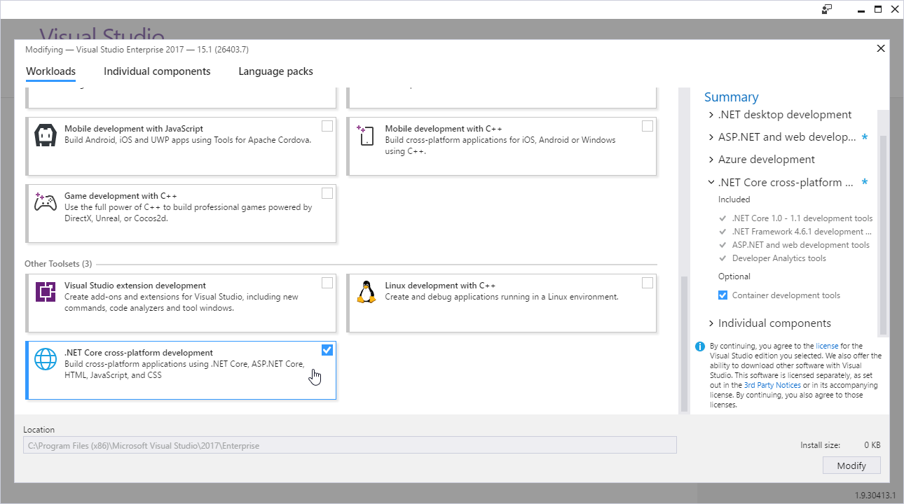

# Azure Gaming Workshop - Introduction

To be able to participate in this workshop, you **need to have an Azure account ready**. There are several ways to get it:

* Start a [free trial](https://azure.microsoft.com/en-us/free/).
* Check your MSDN subscription if you have one, as there are some [Azure credits as a banefit](https://azure.microsoft.com/en-us/pricing/member-offers/msdn-benefits-details/).
* Activate an Azure Pass, if provided by organizers at the workshop.

This workshop doesn't involve too much coding, but it's always good to **have a code editor at hand**. Our step-by-step guides use [Visual Studio 2017](https://www.visualstudio.com/) on Windows, but the source code is written cross-platform using .NET Core, so you are able to work with it on Linux or Mac as well.

> Did you know that there's [Visual Studio Code](http://code.visualstudio.com) for Linux? And special edition [Visual Studio for Mac](https://www.visualstudio.com/cs/vs/visual-studio-mac/)?

If you're not using Visual Studio on Windows, [install .NET Core separately](https://www.microsoft.com/net/core).

If you are using Visual Studio on Windows, don't forget to **check the .NET Core workload** before installation.

And since we're going to work with Azure Storage, install the [Storage Explorer](http://storageexplorer.com/) tool (which is cross-platform as well).