# Azure Gaming Workshop - Compute

...

## Introduction

In this workshop you will learn how to create Azure compute resources for a gaming backend. There are plenty of ways you can achieve that - you can base your backend on APIs and work with PaaS services exclusively, you can use containers, you can use virtual machines etc.

For today **let's assume we have a legacy game server application** which is able to run on Windows and Linux. It's a standalone EXE with libraries and assets. You will try the following:

1. Create a **single virtual machine** for simple "lift-and-shift" approach.
2. Create a **virtual machine scaleset** for highly-scalable infrastructure.

We will work with [OpenTTD](https://www.openttd.org/en/), an open-source simulation game based upon Transport Tycoon Deluxe. It's free and I love it :) The same package is able to run both as a client and dedicated server, which is perfect for this workshop.

Let's get to it!

## 1. Dedicated Virtual Machine

> Make sure you have your Azure account ready and you are signed in to the [Azure Portal](https://portal.azure.com).
>
> Prepare your IDE of choice. We recommend [Visual Studio 2017](https://www.visualstudio.com/) or [Visual Studio Code](https://code.visualstudio.com/).

We will work with the [Azure Portal](https://portal.azure.com) now.

1. Click **+ New** at the top left corner.

2. Select **Compute** and then **Windows Server 2016 Datacenter**.

   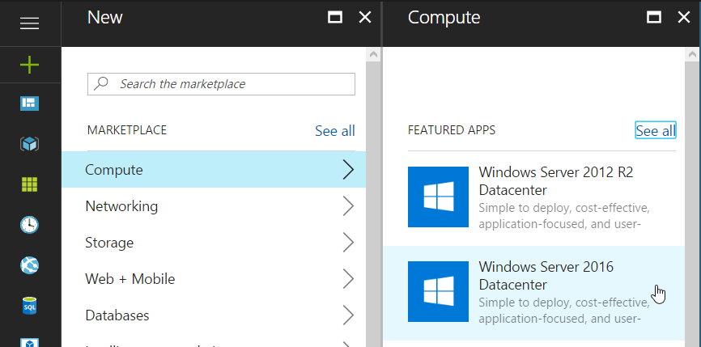

3. Click **Create** at the bottom.

4. Choose a **Name** for your machine (such as *ottdserver*).

5. Switch **VM disk type** to **HDD**.

6. Pick administrator **username** and **password**.

7. Make sure you have the right **subscription** selected (if you have only one, there shouldn't be a problem).

8. **Create new** Resource group, call it *OTTDServer*.

9. Set **Location** as **North Europe**.

10. Click **OK**.

11. Click **View all** above the VM sizes list.

    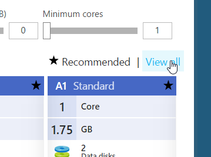

12. Find **F2 Standard**, select it and click **Select**.

13. Leave the *Settings* page without changes and click **OK**.

14. On the *Summary* page, wait for the validation to complete and then click **OK**.

The virtual machine will be deployed in a few minutes. You will know that it's done when it opens up in the portal.

To connect to the machine and install the server, you will use **Microsoft Remote Desktop**. It's a standard part of Windows installation, if you're using Mac, the client is [available for download from App Store](https://itunes.apple.com/cz/app/microsoft-remote-desktop/id715768417).

> Remote Desktop app is also available for Windows Phone, Android and iOS... If you wanted to control your servers from a phone.

We could connect using the IP address, but for convenience we will set up a DNS name.

1. In the **Essentials** view find **Public IP address** and click it.

   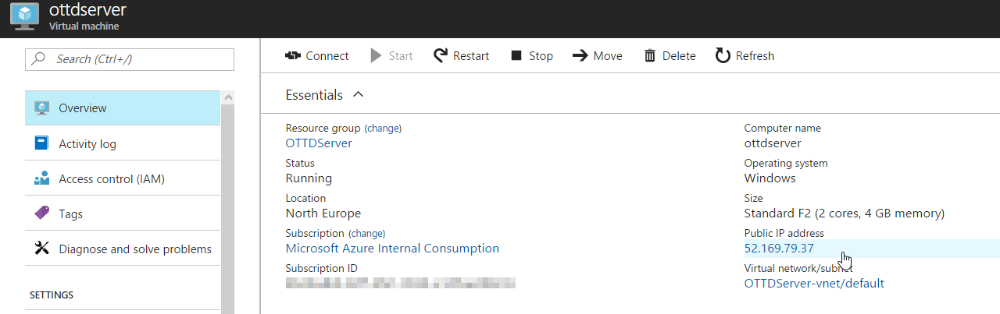

2. Set the **DNS name label (optional)** to something unique.

   ​	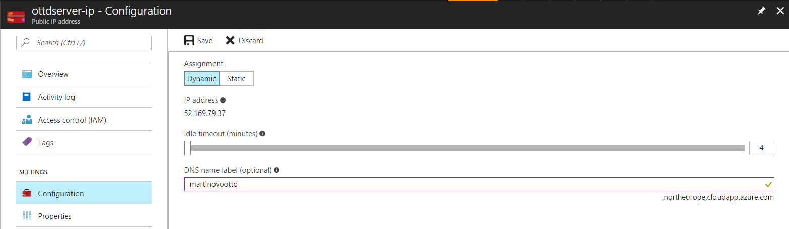

3. Click **Save**.

> Notice that you could also reserve a static IP address here.

Let's connect: run the **Remote Desktop Connection** app and fill your DNS name (something like *yourname.northeurope.cloudapp.azure.com*). Then click **Connect**.

System will ask for your account information - enter your administrator's **username** and **password** (you set it when creating the machine).

Confirm the security certificate warning (**Yes**).

Now download the server software:

1. In the **Server Manager** click **Local Server** on the left.

2. Click the **On** label next to **IE Enhanced Security Configuration**.

   ​	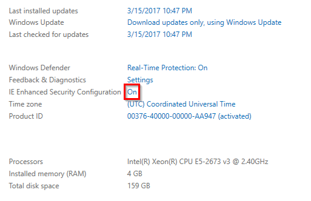

3. Switch both settings to **Off** and click **OK**.

4. Run **Internet Explorer** on the server and download OpenTTD ZIP archive from https://binaries.openttd.org/releases/1.7.0/openttd-1.7.0-windows-win64.zip

5. Once downloaded extract the ZIP file (by opening it in file explorer and clicking `Extract > Extract All > Extract`).

6. Run **openttd.exe**.

7. Confirm the download of graphics assets.

8. Confirm that OpenTTD works.

To make the server standalone and replicable, you are going to need two files from user's Documents folder.

1. Navigate to the OpenTTD folder in your user's **Documents** folder.
   * The path looks like this: `C:\Users\<your username>\Documents\OpenTTD\`
2. Copy the **openttd.cfg** file and place it in your extracted OpenTTD folder.
3. Copy the /content_download/baseset/**OpenGFX-0.5.2.tar** and place it to the **baseset** folder in your extracted OpenTTD folder.

Finally, start the server using command line pointing to OpenTTD folder:

`openttd.exe -D`

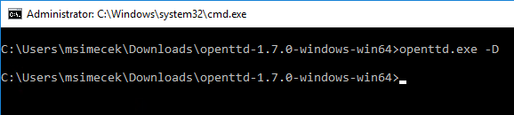

By default, Windows activates a firewall to protect the machine. You will need to enable TCP and UDP ports of OpenTTD. Run PowerShell console (`Start > Windows PowerShell`) and enter two commands:

```powershell
New-NetFirewallRule -Name AlloW_OpenTTD_TCP -DisplayName "Allow OpenTTD TCP" -Description "OTTD Server" -Protocol TCP -LocalPort 3979 -Enabled True -Profile Any -Action Allow

New-NetFirewallRule -Name AlloW_OpenTTD_UDP -DisplayName "Allow OpenTTD UDP" -Description "OTTD Server" -Protocol UDP -LocalPort 3979 -Enabled True -Profile Any -Action Allow
```

This enabled OpenTTD ports in the virtual machine's firewall. **That's not enough though**. We need to enable it on Azure firewall as well.

1. Go back to the **Azure Portal** and to your virtual machine.

2. Click **Network interfaces** in the left panel.

3. Select the only network interface that will be in the list.

4. In the **Essentials** section click on the **Network security group**.

   ​	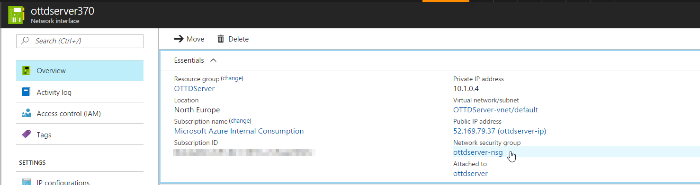

5. Click **Inbound security rules** in the left panel.

6. Click **Add**.

7. Name the rule *OpenTTD*.

8. Set **Port range** to *3979*.

9. Confirm **OK**.

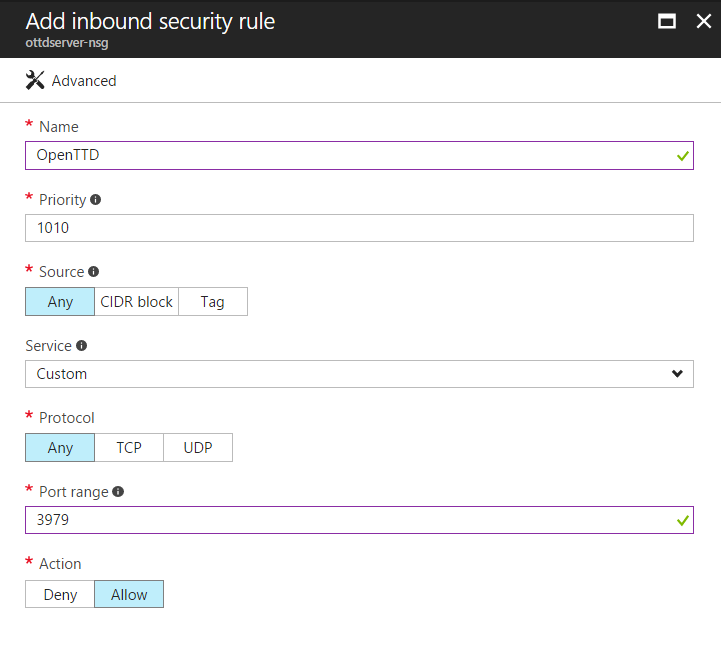

Let's try to connect to our game now! Install and run the OpenTTD client on your PC/Mac, click **Multiplayer**, **Add server** and enter the DNS name of your server.

You should see an "Unnamed server" and be able to join the game.

> To configure details of your server, see the [Network] section in **openttd.cfg**.

Don't forget to **stop the machine once you're done with it**. You do it at the Portal, above the Essentials section of your VM.

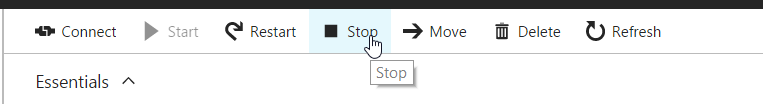

## 2. Virtual Machine Scale Set

You've seen so far how to create a single vitrual server. What if you wanted more of them? You could extract a generalized image and clone it manually, or you can leave this to Azure and use a scaleset.

Instead of creating 30 clones of the server manually, we will use Azure Resource Manager and simple PowerShell script to provision up to 100 of instances of the OpenTTD server.

1. Download **ottd-vmss.json** and **install-server.ps1** from **Scripts** folder in this repo.
2. Start **Visual Studio Code** and click `File > Open Folder...` (or use Visual Studio 2017 or your text editor of choice).
3. Find the directory where you downloaded the two files and open it in VS Code.
4. Examine both scripts.

The *ottd-vmss.json* file is a **Resource Manager Template** which declaratively specifies which resources should be deployed. It begins with `parameters` section, followed by `variables` and finally `resources`. The most important resource for us is the **Virtual Machine Scale Set**: `Microsoft.Compute/virtualMachineScaleSets`.

In the template we declare that:

* it will run Windows Server 2016,
* use the configured username and password,
* connect to a virtual network,
* set NAT rules, opening TCP/UDP port 3979 on an external range from 50001 to 50099
* run a **Custom script** on start.

```json
"extensions": [
{
   "name": "customScript",
   "properties": {
      "publisher": "Microsoft.Compute",
      "settings": {
         "fileUris": [
             "[concat(parameters('_artifactsLocation'), '/install-server.ps1')]"
         ]
      },
      "typeHandlerVersion": "1.8",
      "autoUpgradeMinorVersion": true,
      "protectedSettings": {
         "commandToExecute": "powershell -ExecutionPolicy Unrestricted -File install-server.ps1"
      },
      "type": "CustomScriptExtension"
   }
}]
```

This is basically saying:

> "Every time a machine starts, use PowerShell to run the install-server.ps1 script."

Which brings us to the second file - *install-server.ps1*:

```powershell
$Source = "<excluded>"
$Destination = "D:\Server\"
$DestinationZip= $Destination + "OpenTTD.zip"

if ((Test-Path $Destination) -eq $false) {
    
    New-Item $Destination -Type Directory -Force

    $WebClient = New-Object -TypeName System.Net.WebClient
    $WebClient.DownloadFile($Source, $DestinationZip)
    Expand-Archive $DestinationZip -DestinationPath $Destination

    New-NetFirewallRule -Name AlloW_OpenTTD_TCP -DisplayName "Allow OpenTTD TCP" -Description "OTTD Server" -Protocol TCP -LocalPort 3979 -Enabled True -Profile Any -Action Allow
    New-NetFirewallRule -Name AlloW_OpenTTD_UDP -DisplayName "Allow OpenTTD UDP" -Description "OTTD Server" -Protocol UDP -LocalPort 3979 -Enabled True -Profile Any -Action Allow
}

# TODO: download config separately

Start-Process "$($Destination)OpenTTD\openttd.exe" -ArgumentList "-D"
```

Step by step, this script:

1. checks if OpenTTD is already installed and if not,
2. creates a new folder,
3. downloads the OpenTTD.zip with our dedicated server package,
4. extracts it to D:\Server\OpenTTD,
5. creates local firewall rules for TCP and UDP ports 3979,
6. starts the OpenTTD server.

> Beware that in this case we're saving the server to local disk D:. This is faster storage but **non-persistent**. Chances are that once you deallocate the instance all data from disk D will be gone.

You can deploy the script using PowerShell, [Azure CLI](https://docs.microsoft.com/en-us/cli/azure/install-azure-cli) or automatically through [Continuous Integration](https://docs.microsoft.com/en-us/azure/vs-azure-tools-resource-groups-ci-in-vsts). We will use the simplest way - **Template Deployment** in the Azure Portal. 

1. Back on the Portal dashboard click **+ New**.

2. Search for **Template Deployment**.

   ​	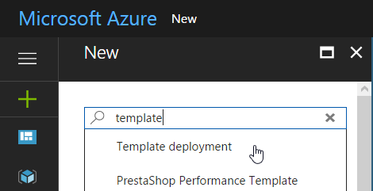

3. Select Template deployment from Microsoft and click **Create**.

4. Click **Edit template**.

   ​	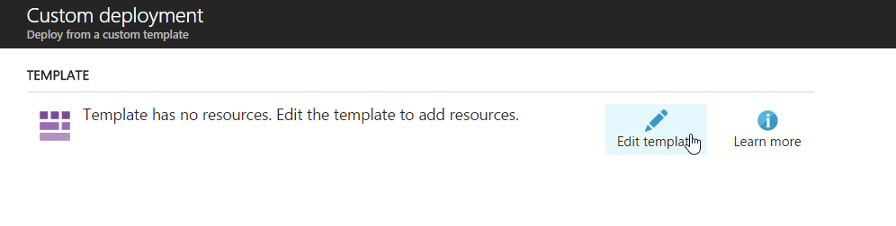

5. **Copy JSON** code from *ottd-vmss.json* and replace contents of the Edit template editor.

6. Wait until parameters, variables and resources show up and click **Save**.

7. Fill required parameters (the same naming rules as for virtual machines apply):

   1. resource group name (no spaces, no uderscores),
   2. scaleset **name** (should be unique),
   3. admin **username** and **password**,
   4. don't change the **artifacts location** parameter.

8. Confirm by clicking **Purchase**.

Deployment takes a few minutes, because it needs to provision the whole infrastructure, start two (or more, depending on your parameter) server instances and run the startup script on them.

1. Once the deployment is done, go to the new Resource Group and select **loadBalancer**.

2. Click **Inbound NAT rules** in the left panel.

   ​	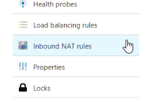

3. Check the ports which were assigned to your servers (you should see twice the rules as the number of instances - for TCP and UDP).

   ​	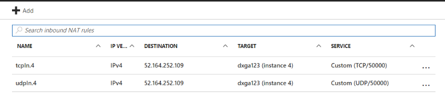

   > For example on this image we see that port **50000** points to instance number **4**.

If everything went right, you should be able to connect to your instances now. Let's start the game on your computer, go to **Multiplayer** > **Add server** and enter your scaleset DNS address followed by port number.

`<scaleset name>.northeurope.cloudapp.azure.com:50000`

The DNS name can be found on the Public IP address resource (called *pip* in our case):

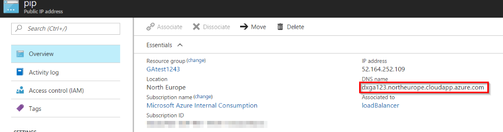

Your game should be ready:

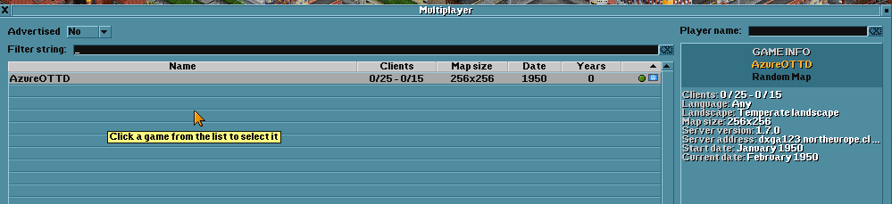

Now imagine you needed more compute power to handle the load. To increase the number of instances go back to your scaleset at the Azure Portal and click **Scaling**.

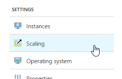

There you can change the size and number of instances.

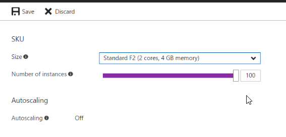

And again - once you're done with the scaleset, **don't forget to deallocate it** to stop incurring charges.

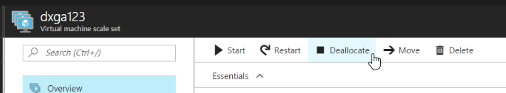

## Wrap-up

There are several approaches you can take when deploying your game server to production.

* You can pre-provision a desired number of instances and deallocate those which are not needed yet.
* Or you can scale up "just-in-time", as the need grows.
* You would most probably build some kind of an **orchestrator API** which would route your game client to appropriate server/port.
* And you would create a management tool for monitoring your server instances and adding more.

In this exercise you saw how to create a virtual machine in Azure using the Azure Portal and how to script a Virtual Machine Scale Set using Azure Resource Manager.