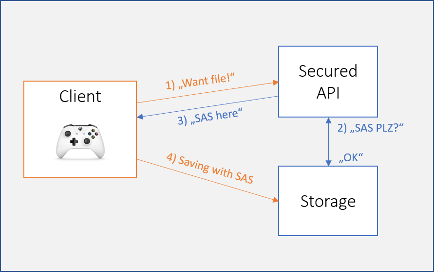

# Azure Gaming Workshop - Data

...

## Introduction

There are plenty of ways you can work with data in Azure - SQL Database, Storage Tables, HDInsight etc. In this part we will focus on two of them and simulate two ways of persisting game data in the cloud:

* saving binary blobs to Azure Storage,
* saving JSON data to Azure DocumentDB.

The tools you will need on your PC/Mac:

* [Azure Storage Explorer](http://storageexplorer.com/)
* [Visual Studio 2017](https://www.visualstudio.com/) (Community Edition is free for educational purposes, **make sure you install the .NET Core workload**)
* if you're on a Mac, you can download [Visual Studio for Mac Preview](https://www.visualstudio.com/vs/visual-studio-mac/)

We will work with .NET Core, so in case you don't want to use Visual Studio, you can just download [.NET Core tooling](https://www.microsoft.com/net/core) and use command line / Bash.

## Azure Storage Blobs

Storage is one of the most used Azure building blocks. It supports almost every service in Azure and is available to use in your applications. It consists of four parts:

* **Blobs** for storing general files and VM disks.
* **Files** for SMB file shares.
* **Tables** to store millions of rows of non-relational data.
* **Queues** to decouple applications.

We will use Storage Blobs to upload a saved game binary file from a mock game client.

1. Open the [Azure Portal](https://portal.azure.com) and log in.

2. Click **+ New** a search for **Storage account**.

   ​	

3. Click **Create**.

4. Pick a **name** for your Storage Account (needs to be unique).

5. Change **Replication** to **Locally-redundant storage (LRS)**.

6. **Create new** Resource group with an appropriate name.

7. Click **Create**.

This will create new Storage Account - basically a URL root for your files. Data is uploaded to Containers and then finally blobs.

1. Open your new Storage Account.

2. Click **Blobs**.

   

3. Click **+ Container** at the top.

4. Call it *saves* and leave **Access type** as **Private**.

   

5. Confirm **OK**.

Since the container is Private, we need to obtain a proper SAS (Shared Access Signature) token before uploading to it. Because this is a sensitive information, good practice is to create an API which will generate and distribute time-limited tokens to clients.



1. Go back to your Storage Account at the Azure Portal.

2. Click **Access keys** in the left menu.

   ​	

3. Copy the whole **Connection String** of *key1* (hint: use the Copy button on the right side):

   ​	

4. Save it to Notepad.

5. Download the C# solution from [Source](Source/) folder in this repo.

6. **Open the SLN** file in Visual Studio.

There are two projects in this solution: first is the client console app (which represents a game client), second is the API which will distribute tokens.


> Both projects use .NET Core therefore will work on Windows, Mac and Linux.

1. Open the API project and go to **appsettings.json** file.
2. Paste your storage account's connection string as a value of the **StorageAccountConnectionString** JSON property.
3. Make sure that the **SavesContainer** property has a value of *saves*.

The resulting *appsettings.json* should look like this:

```json
{
  "BlobStorage": {
    "StorageAccountConnectionString": "DefaultEndpointsProtocol=https;AccountName=gawshop;AccountKey=<key>;EndpointSuffix=core.windows.net",
    "SavesContainer": "saves"
  },
  "Logging": {
    "IncludeScopes": false,
    "LogLevel": {
      "Default": "Warning"
    }
  }
}
```

Open the **SaveController.cs** and examine the code.

We're using ASP.NET Core WebAPI with one Controller containing one method on URL `/api/save/bloburl`.

This method uses the **Azure Storage SDK** to obtain a **Shared Access Policy** for a particular file (in this case called *save.sav*) and return it.

> In real world, you would require authentication on this method and generate the file name based on current user.

```csharp
public async Task<string> GetBlobUrl()
{
    var client = GetCloudBlobClient();
    var container = client.GetContainerReference(_configuration.GetValue<string>("BlobStorage:SavesContainer"));
    await container.CreateIfNotExistsAsync();

    var blobName = "save.sav"; // should be unique for a particular player
    var blob = container.GetBlockBlobReference(blobName);

    SharedAccessBlobPolicy policy = new SharedAccessBlobPolicy()
    {
        Permissions = SharedAccessBlobPermissions.Read | SharedAccessBlobPermissions.Write | SharedAccessBlobPermissions.Create,
        SharedAccessExpiryTime = DateTime.UtcNow.AddHours(24),
    };

    var sas = blob.GetSharedAccessSignature(policy);

    return blob.Uri + sas;
}
```

The API creates a time-limited write access to a blob. In this case we're using 24 hours, it is obviously more secure to make this time shorter (1 hour or less).

From the client point of view uploading the save file is a matter of two steps:

1. Request file URI with SAS token.
2. Upload directly to Blob Storage.

> To optimize this, we could check the token expiration time and skip first request if not expired yet.

To run the API and test client, build them first:

* In Visual Studio right click the solution in Solution Explorer and select **Rebuild Solution**.

  ​	

* In command line navigate to root directory of the project and type:

  * `dotnet restore`
  * `dotnet build`

Make sure that the API is set as a startup project (its name should be bold). If not, right click the project in Solution Explorer and select **Set as StartUp Project**.


Run it by pressing **F5** or the green arrow with label **IIS Express**.


> ASP.NET Core projects need a hosting container in which they run. It can be IIS (or IIS Express) on Windows, but it can also be nginx or Apache.

Visual Studio will switch to debug mode and run the API on your local machine. You can verify that it works by navigating your web browser to http://localhost:43551/api/save/bloburl .


Use command line to run the client - navigate to the solution's directory and then to `GameAccess_BlobStorage\GameAccess_BlobStorage\bin\Debug\netcoreapp1.1`.

Run the app:

`dotnet GameAccess_BlobStorage.dll`


Finally, verify that the file was successfuly uploaded by looking directly to the container.

1. Run **Azure Storage Explorer**.

2. **Login** with your Microsoft Account (the one you are using with Azure).

3. Expand **Storage Accounts**.

4. Find the storage account with saved games.

5. Expand **Blob Containers**.

6. Double click ***saves***.

   

The *save.sav* file should be in the list.

Players' data is securely persisted in the cloud now. You can download and copy it, but that's pretty much all you can do with it. What if you wanted to know, which player has the largest score? Moving on to...

## DocumentDB

Azure DocumentDB is a highly scalable, globally-distributed NoSQL database service. It works with JSON documents and offers SQL-like query language.